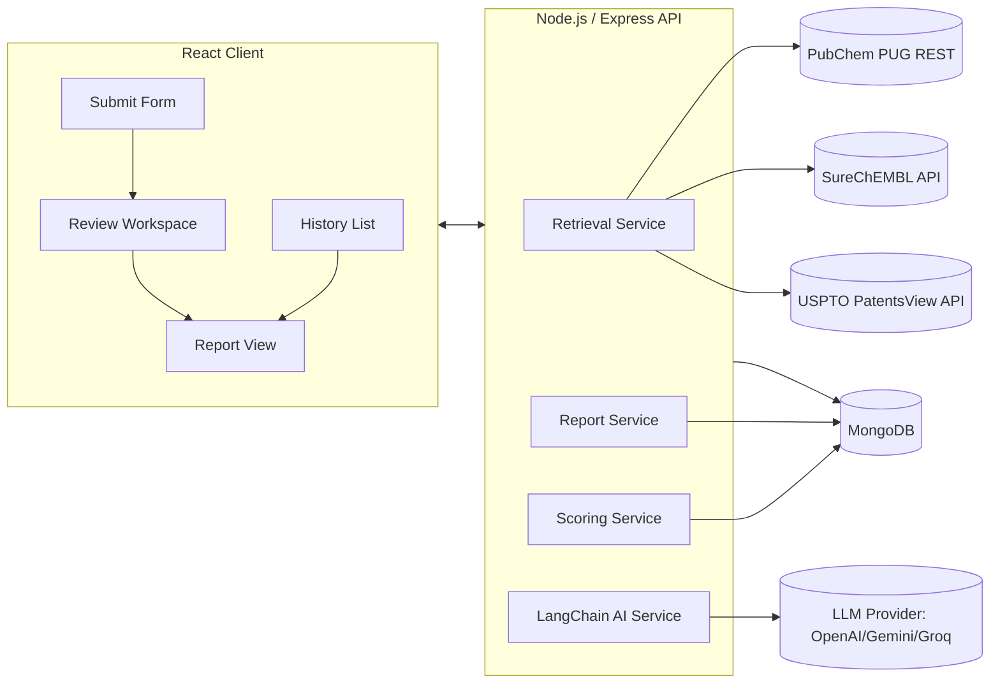

# PatentPilot — Product Requirements Document

**Version:** 1.0
**Stack:** MERN (MongoDB, Express, React, Node.js) + LangChain
**Target:** Rapid build via Antigravity, satisfying all assessment requirements

---

## 1. Overview

PatentPilot is a lightweight web workspace that lets a researcher submit a molecule (SMILES) and get an AI-assisted, evidence-backed initial Freedom-to-Operate (FTO) signal: relevant existing patents, per-patent reasoning, and a structured patentability report with a clear risk recommendation.

This is explicitly a **screening tool**, not a legal opinion. Every output must be traceable to retrieved data — no unsupported LLM claims.

## 2. Goals & Non-Goals

**Goals**
- Cover all 4 functional pillars from the brief: Molecule Submission → Patent Discovery → Review Workspace → AI Analysis → Report → History.
- Use a defensible, documented hybrid retrieval strategy (structural + keyword + semantic).
- Keep every AI explanation grounded in the specific retrieved patent text — never generic.
- Ship on free-tier/no-key public data sources only.

**Non-Goals**
- No claim-by-claim legal infringement analysis (out of scope for an initial screen).
- No support for biologics/peptide/macromolecule structures — small molecules (valid organic SMILES) only.
- No multi-user auth/roles for v1 — single-researcher workspace, session-less history.

## 3. Core User Journey

1. Researcher pastes a SMILES string, optionally adds target + indication.
2. System validates the molecule, retrieves candidate patents from multiple sources, scores and ranks them.
3. Researcher reviews ranked patents in a workspace view, each with an AI-generated "why this matched" explanation.
4. Researcher clicks "Generate Report" → structured patentability report with a Low / Requires Review / High Risk recommendation.
5. Report and query are saved to History for later retrieval.

## 4. Functional Requirements

### 4.1 Molecule Submission
- Inputs: `smiles` (required), `target` (optional, free text), `indication` (optional, free text).
- Server-side validation: attempt a PubChem lookup on the SMILES; reject with a clear error if PubChem cannot parse it (this doubles as format validation, avoiding a separate cheminformatics dependency).
- On success, store canonical SMILES + PubChem CID and kick off the retrieval pipeline.

### 4.2 Patent Discovery (Retrieval Strategy)
Hybrid retrieval across three free, no-key public sources — see Section 7 for full detail:
- **Structural similarity** — PubChem 2D fingerprint similarity search, cross-referenced against SureChEMBL's structure-to-patent mapping.
- **Keyword/full-text** — USPTO PatentsView API, queried with target/indication/molecule synonyms.
- **Semantic ranking** — embedding cosine-similarity between the query context (molecule description + target + indication) and each candidate patent's title+abstract.
- Merge, dedupe by patent number, compute a composite relevance score (Section 9), return ranked list.

### 4.3 Patent Review Workspace
For each retrieved patent, display: title, patent number, publication date, assignee, abstract, source (SureChEMBL / PatentsView), composite relevance score, and the AI explanation (4.4). Sortable/filterable by score, date, source. Researcher can flag a patent as "reviewed" or "needs manual look" — this feeds the report.

### 4.4 AI-Assisted Per-Patent Analysis
One structured LLM call per top-K patent (K≈15–20, not the full retrieved set — see Section 13 on cost control). Output is JSON with four fields, each grounded in the actual patent text and the query molecule/target/indication:
- `whyRetrieved` — which retrieval signal(s) fired and why (e.g., "structural similarity 0.86 to claimed Markush core" / "shares target + indication keywords").
- `similarAspects` — specific overlapping structural or functional elements, named concretely.
- `potentialOverlap` — what a novelty/FTO concern would look like here, in plain terms.
- `confidence` — High/Medium/Low + one-line reasoning (e.g., low if abstract is truncated or structure match is only partial).

Prompt must forbid generic boilerplate output — enforced via a structured-output schema (Section 8) and a "cite specific evidence" instruction.

### 4.5 Patentability Report
Generated once the researcher has reviewed candidates. Structure:
- **Executive Summary** — 3–5 sentences, plain language.
- **Key Similar Patents** — top N by composite score, each with a one-line rationale.
- **Potential Novelty Concerns** — synthesized from per-patent `potentialOverlap` fields, not re-generated from scratch.
- **Patents Requiring Manual Review** — flagged low-confidence or data-incomplete patents.
- **Overall Recommendation** — `Low Patent Risk` / `Requires Expert Review` / `High Patent Risk`, with the scoring rationale spelled out (Section 9).

### 4.6 Analysis History
Every submitted query + its report is persisted (MongoDB) and listed on a History page (molecule, target, date, recommendation badge). Clicking an entry reopens the full report and patent list without re-running retrieval (cached).

## 5. System Architecture



**Layers**
- **Client:** React (Vite) + TailwindCSS + React Query. Four views: Submit, Review Workspace, Report, History.
- **Server:** Express REST API. `retrieval/`, `scoring/`, `ai/`, `reports/` as separate service modules — keeps the LangChain layer swappable and testable independent of retrieval.
- **AI layer:** LangChain (JS) wrapping the LLM provider, configurable via `.env` (`LLM_PROVIDER=openai|gemini|groq`).
- **DB:** MongoDB via Mongoose. Patents are cached by patent number so repeat queries don't re-hit external APIs.

## 6. Data Sources & Retrieval Strategy (Detail)

| Source | Role | Why |
|---|---|---|
| **PubChem PUG REST** | SMILES validation, canonicalization, CID lookup, 2D fingerprint similarity search (`fastsimilarity_2d`) | Free, no key, offloads fingerprint/Tanimoto computation server-side — no need to run RDKit locally, keeps the stack pure Node. |
| **SureChEMBL** | Structure-to-patent mapping — which patents disclose this or a similar structure | Purpose-built for exactly this: chemical structure → patent linkage. Primary structural-risk source. |
| **USPTO PatentsView API** | Keyword/full-text search on target, indication, molecule name/synonyms | Free, well-documented, catches patents that discuss the compound by name/mechanism without a deposited structure in SureChEMBL — fills the gap structural search alone misses. **Note:** as of the current API version, requests require a free registered API key (`X-Api-Key` header) — the old fully-open version was discontinued May 1, 2025. Request the key at the start of the build (Section 15, Phase 0), not when you get to Phase 3 — issuance isn't always instant. |

**Pipeline**
1. Resolve SMILES → canonical SMILES + CID (PubChem).
2. Structural candidates: PubChem similarity search → cross-reference resulting CIDs against SureChEMBL structure search.
3. Keyword candidates: PatentsView full-text query built from target + indication + any PubChem synonyms for the molecule.
4. Merge both candidate sets, dedupe by patent number, fetch full metadata (title, abstract, assignee, date) for each.
5. Score every candidate (Section 9) and return ranked list to the client.

This is a genuine hybrid: structural search anchors chemical relevance, keyword search anchors therapeutic/context relevance, and semantic scoring (embeddings) reconciles the two into one ranking.

## 7. AI Workflow (LangChain)

Two distinct chains:

**Chain A — Per-Patent Explanation** (runs for top-K candidates only)
- Input: query molecule (SMILES, target, indication) + one patent's title/abstract + its structural/semantic/keyword scores.
- Output schema (enforced via LangChain structured output):
```json
{
  "whyRetrieved": "string",
  "similarAspects": "string",
  "potentialOverlap": "string",
  "confidence": "High | Medium | Low",
  "confidenceReasoning": "string"
}
```
- System prompt explicitly instructs: reference the actual score values and actual patent text; never output boilerplate like "this patent may be relevant."

**Chain B — Report Synthesis** (runs once per query)
- Input: the full set of per-patent Chain A outputs + composite scores, not the raw patents — this keeps the report grounded in already-verified analysis rather than re-summarizing raw text.
- Output schema:
```json
{
  "executiveSummary": "string",
  "keySimilarPatents": [{ "patentNumber": "string", "rationale": "string" }],
  "noveltyConcerns": ["string"],
  "manualReviewPatents": [{ "patentNumber": "string", "reason": "string" }],
  "recommendation": "Low Patent Risk | Requires Expert Review | High Patent Risk",
  "recommendationRationale": "string"
}
```
- The `recommendation` field is **not** left to the LLM's judgment alone — it's computed programmatically (Section 9) and passed into the prompt as a fact to explain, not a decision to make. This keeps the risk tier deterministic and auditable.

## 8. Scoring Methodology

Documented explicitly (per assessment requirement) — this is the core of "how the recommendation was reached."

**Per-patent composite score (0–100):**

```
composite = 0.4 × structuralSimilarity
          + 0.3 × semanticRelevance
          + 0.2 × keywordOverlap
          + 0.1 × recencyWeight
```

- `structuralSimilarity` — PubChem/SureChEMBL Tanimoto-based similarity, scaled 0–100.
- `semanticRelevance` — cosine similarity between an embedding of (target + indication + molecule context) and an embedding of (patent title + abstract), scaled 0–100.
- `keywordOverlap` — normalized match score between target/indication terms and patent title/abstract.
- `recencyWeight` — patents within a live enforcement window (filed/granted in the last ~20 years) score higher; clearly expired patents are down-weighted since they carry lower FTO risk.

**Molecule-level recommendation** (computed from the full ranked patent set, not just the top one):
- **Low Patent Risk** — highest composite score among all candidates < 40, and no patent scores ≥ 70.
- **Requires Expert Review** — highest composite score is 40–69, OR exactly one patent scores ≥ 70 but with Medium/Low confidence or incomplete data.
- **High Patent Risk** — structural similarity component alone ≥ 85 on any patent, OR two or more patents have composite ≥ 70.

**Manual review flag** (independent of the risk tier) — a patent is flagged for manual review if its Chain A `confidence` is Low, or if its structural and semantic scores disagree by more than 30 points (signals the two signals are telling different stories and a human should look).

This rubric is intentionally simple and transparent over "black-box accurate" — every number in the report can be traced back to a specific API response or embedding calculation.

## 9. Data Model (MongoDB / Mongoose)

```
Query {
  _id, smiles, canonicalSmiles, pubchemCid,
  target, indication, submittedAt, status
}

Patent {                          // cached globally, keyed by patentNumber
  _id, patentNumber, title, abstract, assigneeName,
  publicationDate, filingDate, source, url,
  fetchedAt
}

PatentScore {                     // per query-patent pair
  _id, queryId, patentId,
  structuralSimilarity, semanticRelevance, keywordOverlap,
  recencyWeight, compositeScore
}

Analysis {                        // Chain A output, per query-patent pair
  _id, queryId, patentId,
  whyRetrieved, similarAspects, potentialOverlap,
  confidence, confidenceReasoning, generatedAt
}

Report {                          // Chain B output, per query
  _id, queryId, executiveSummary,
  keySimilarPatents, noveltyConcerns, manualReviewPatents,
  recommendation, recommendationRationale, generatedAt
}
```

## 10. API Endpoints

| Method | Path | Purpose |
|---|---|---|
| POST | `/api/molecules` | Submit molecule → validate, resolve CID, trigger retrieval |
| GET | `/api/molecules/:id` | Query status/details |
| GET | `/api/molecules/:id/patents` | Ranked, scored patent list |
| POST | `/api/molecules/:id/analyze` | Trigger Chain A for top-K patents |
| GET | `/api/patents/:id/analysis` | Fetch one patent's AI explanation |
| POST | `/api/molecules/:id/report` | Trigger Chain B → generate report |
| GET | `/api/reports/:id` | Fetch a report |
| GET | `/api/history` | List past queries + report summaries |
| GET | `/api/history/:id` | Reopen a past query's full report |

## 11. Tech Stack

- **Frontend:** React (Vite), TailwindCSS, React Query, React Router
- **Backend:** Node.js, Express, Mongoose
- **Database:** MongoDB
- **AI:** LangChain (JS), LLM provider configurable via env (OpenAI / Gemini / Groq)
- **Embeddings:** provider's embedding model (e.g., `text-embedding-3-small`), precomputed and cached per patent to avoid recompute
- **External APIs:** PubChem PUG REST (free, no key), SureChEMBL REST API (free, no key), USPTO PatentsView API (free, but requires a registered `X-Api-Key` — request it on day one)

## 12. Non-Functional Requirements

- **Rate limiting:** throttle/queue outbound calls to PubChem, SureChEMBL, and PatentsView to respect their free-tier limits; retry with backoff on 429s.
- **Caching:** patents cached by patent number in MongoDB — a repeat query for a related molecule reuses already-fetched patent metadata.
- **Graceful degradation:** if one external source is down, return partial results and clearly flag which source failed rather than failing the whole request.
- **Cost/latency control:** Chain A only runs on the top-K pre-scored candidates, not every retrieved patent — keeps LLM spend and response time bounded regardless of how many raw candidates come back.

## 13. Assumptions

- Input is a valid small-molecule organic SMILES (not biologics/peptides/large macromolecules).
- Free-tier public API coverage (PubChem, SureChEMBL, PatentsView) is sufficient for an initial screening tool — not a substitute for a paid, comprehensive patent database in production use.
- English-language patents only, given the chosen APIs' coverage.
- PatentsView's US-centric coverage is an acceptable initial scope; non-US patent coverage is a future improvement.

## 14. Trade-offs

- **PubChem/SureChEMBL/PatentsView over Google Patents scraping** — avoids ToS risk and scraping fragility, at the cost of narrower full-text patent coverage (PatentsView is US-focused).
- **PubChem-hosted fingerprint similarity over local RDKit** — faster to ship, zero extra service/dependency, keeps the stack pure MERN, but less chemically nuanced than a full local substructure/scaffold analysis.
- **LLM analysis limited to top-K patents** — bounds cost and latency, at the cost of not generating a per-patent AI explanation for every low-relevance candidate (acceptable since those are, by construction, the least relevant).
- **Deterministic scoring feeding the LLM, rather than LLM-decided recommendation** — sacrifices some flexibility for auditability; every recommendation is explainable by a fixed formula, not a black-box judgment call.

## 15. Build Plan (execution order)

0. **Request PatentsView API key immediately** (before anything else) — issuance isn't always instant, and everything in Phase 3 blocks on it.
1. **Scaffold** — repo structure (`client/`, `server/`), Express server, MongoDB connection, React app shell with routing (Submit → Review → Report → History), `.env.example`.
2. **Molecule submission + PubChem integration** — SMILES validation, CID lookup, canonicalization.
3. **Patent retrieval** — SureChEMBL structural search + PatentsView keyword search, merge/dedupe, cache in MongoDB.
4. **Scoring** — compute structural/semantic/keyword/recency scores, composite score; render ranked list in Review Workspace.
5. **AI per-patent analysis** — LangChain Chain A, structured JSON output, wired into the workspace UI.
6. **Report generation** — LangChain Chain B, deterministic recommendation computation, Report view.
7. **History** — persistence + list/detail views.
8. **Polish** — README, this PRD's architecture diagram, loading/error states, final `.env.example`.

## 16. Deliverables Checklist

- [ ] GitHub repository, source code
- [ ] README covering: architecture, retrieval strategy, AI workflow, tech stack, assumptions, trade-offs, future improvements, local setup instructions
- [ ] Architecture diagram (Section 5 mermaid diagram can be reused directly)
- [ ] Working app covering all 4 functional pillars (Submission, Discovery, Review, AI Analysis, Report, History)

> **Note:** the original assessment text has "Centella AI Therapeutics" inserted mid-sentence in a few places (after the PubChem bullet, after the Assignee bullet, etc.), which reads like a plagiarism-detection watermark. Don't paste the raw brief verbatim into the README — write the retrieval strategy and assumptions in your own words (which this PRD already does).

## 17. Future Improvements

- Add non-US/EPO patent coverage (e.g., via Lens.org's free tier) to reduce US-centric bias.
- Local RDKit-based substructure/scaffold matching for chemically deeper structural analysis.
- Claim-level text extraction (not just title/abstract) for higher-precision overlap analysis.
- Batch/portfolio mode — submit multiple molecules from a series and compare risk profiles.
- Export report as PDF/DOCX for sharing outside the tool.
