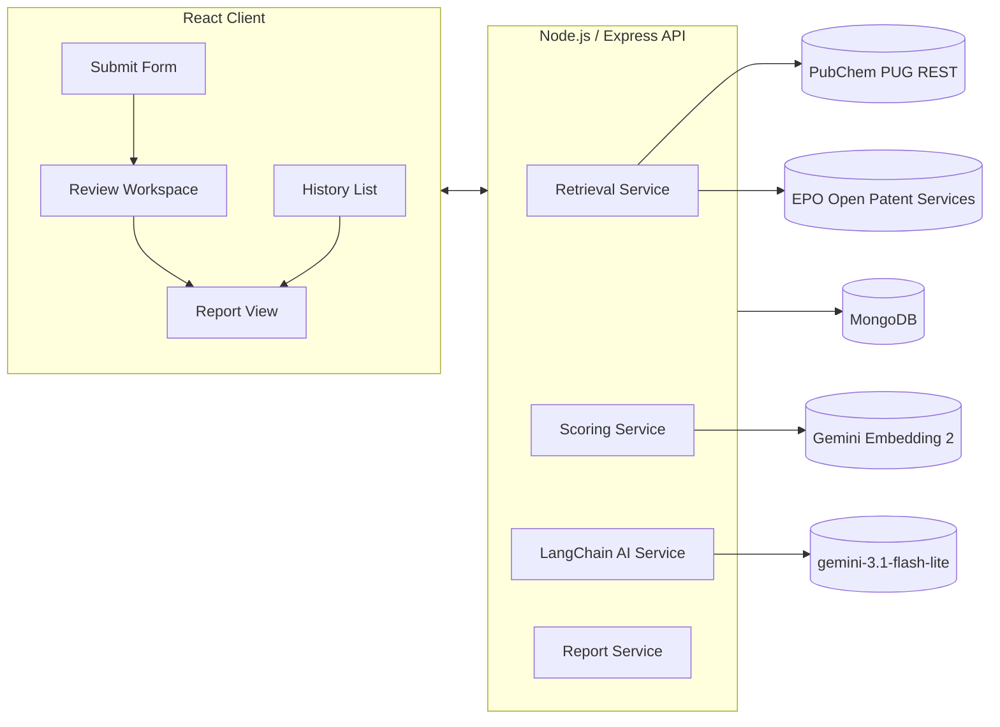

# PatentPilot

A lightweight web workspace that lets a researcher submit a molecule (SMILES) and get an AI-assisted, evidence-backed initial Freedom-to-Operate (FTO) signal: relevant existing patents, per-patent reasoning, and a structured patentability report with a clear risk recommendation.

> **Disclaimer:** PatentPilot is a screening tool only, not a legal opinion. Every output is traceable to retrieved patent data. Consult a qualified patent attorney before any commercialization decision.

---

## Table of Contents

1. [Architecture](#1-architecture)
2. [Retrieval Strategy](#2-retrieval-strategy)
3. [AI Workflow](#3-ai-workflow)
4. [Technologies Used](#4-technologies-used)
5. [Assumptions](#5-assumptions)
6. [Trade-offs](#6-trade-offs)
7. [Future Improvements](#7-future-improvements)
8. [Running Locally](#8-running-locally)

---

## 1. Architecture



**Layers:**

| Layer | Role |
|---|---|
| **Client** | React (Vite) + TailwindCSS + React Query. Four views: Submit, Review Workspace, Report, History. |
| **Server** | Express REST API. `retrieval/`, `scoring/`, `ai/`, `reports/` as separate service modules — keeps the LangChain layer swappable and testable independent of retrieval. |
| **AI layer** | LangChain (JS) wrapping the Gemini API, configured via `.env`. |
| **DB** | MongoDB via Mongoose. Patents are cached by patent number — repeat queries for related molecules reuse fetched metadata without re-hitting external APIs. |

**API Endpoints:**

| Method | Path | Purpose |
|---|---|---|
| POST | `/api/molecules` | Submit molecule → validate, resolve CID, trigger retrieval |
| GET | `/api/molecules/:id` | Query status / details |
| GET | `/api/molecules/:id/patents` | Ranked, scored patent list |
| POST | `/api/molecules/:id/analyze` | Trigger Chain A for top-K patents |
| GET | `/api/patents/:id/analysis` | Fetch one patent's AI explanation |
| POST | `/api/molecules/:id/report` | Trigger Chain B → generate report |
| GET | `/api/reports/:id` | Fetch a report |
| GET | `/api/history` | List past queries + report summaries |
| GET | `/api/history/:id` | Reopen a past query's full report |

---

## 2. Retrieval Strategy

PatentPilot uses a genuine **hybrid retrieval pipeline** — structural search anchors chemical relevance, keyword search anchors therapeutic/context relevance, and semantic scoring (embeddings) reconciles the two into one ranking.

### Data Sources

| Source | Role | Why |
|---|---|---|
| **PubChem PUG REST** | SMILES validation, canonicalization, CID lookup, 2D fingerprint similarity search (`fastsimilarity_2d`), and compound→patent cross-references (`xrefs/PatentID`) | Free, no key. Offloads fingerprint/Tanimoto computation server-side — no need to run RDKit locally. Keeps the stack pure Node. |
| **EPO Open Patent Services (OPS)** | Keyword/full-text search on target, indication, and molecule name/synonyms via INPADOC family data. Also used to enrich retrieved patents with full title, abstract, and assignee. | Free "Non-paying" tier (3.5 GB/week), requires only email registration — no ID.me or government ID. Covers US, EP, WO, and more via INPADOC family data. |

> **Note on USPTO:** the assessment originally mentioned USPTO PatentsView/ODP for keyword search, but as of June 2026 ODP requires ID.me identity verification — a passport-based video call for non-US users, not just slow but genuinely blocked. EPO OPS is the production replacement, not a fallback.

### Pipeline (Step by Step)

1. **Resolve SMILES** — PubChem PUG REST validates and returns canonical SMILES + PubChem CID + IUPAC name. Reject with a clear error if PubChem cannot parse the input (doubles as format validation, no separate cheminformatics dependency needed).
2. **Structural candidates** — Run PubChem `fastsimilarity_2d` at an 85% Tanimoto threshold (up to 30 similar CIDs). For the query CID and each similar CID, query PubChem's `xrefs/PatentID` endpoint to retrieve directly linked patent numbers.
3. **Keyword candidates** — Build a CQL query from the molecule's biological target + indication + top PubChem synonyms. Submit to EPO OPS published-data search (`ti=` / `ab=` fields). Enrich each retrieved patent with title, abstract, and assignee via the EPO OPS biblio endpoint.
4. **Merge + deduplicate** — Combine both candidate sets, deduplicate by patent number (keeping best tanimoto on collision), upsert each patent into the MongoDB cache.
5. **Score and rank** — Compute a 4-component composite score for every candidate (see §3 / Scoring below) and return the ranked list to the client.

---

## 3. AI Workflow

Two distinct LangChain chains using `gemini-3.1-flash-lite`.

### Scoring Methodology

**Per-patent composite score (0–100):**

```
composite = 0.4 × structuralSimilarity
          + 0.3 × semanticRelevance
          + 0.2 × keywordOverlap
          + 0.1 × recencyWeight
```

| Component | Source | Description |
|---|---|---|
| `structuralSimilarity` | PubChem Tanimoto | 2D fingerprint similarity to query molecule, scaled 0–100 |
| `semanticRelevance` | Gemini Embedding 2 | Cosine similarity between query context embedding and patent title+abstract embedding, scaled 0–100. Embeddings are cached per patent to avoid recomputation. |
| `keywordOverlap` | Text matching | Normalized match between target/indication terms and patent title+abstract |
| `recencyWeight` | Publication date | Patents within the live enforcement window (~20 years) score higher; clearly expired patents are down-weighted since they carry lower FTO risk |

**Molecule-level recommendation (computed deterministically — not by the LLM):**

| Tier | Condition |
|---|---|
| **Low Patent Risk** | Highest composite score < 40, and no patent ≥ 70 |
| **Requires Expert Review** | Highest composite score 40–69, OR exactly one patent ≥ 70 with Medium/Low confidence or incomplete data |
| **High Patent Risk** | Structural similarity ≥ 85 on any patent, OR two or more patents have composite ≥ 70 |

**Manual review flag** (per-patent, independent of risk tier): triggered when Chain A `confidence` = Low, or when `|structuralSimilarity − semanticRelevance| > 30` (signals the two retrieval signals disagree — a human should look).

### Chain A — Per-Patent Explanation

Runs for the **top-15 candidates by composite score only** — not the full retrieved set — to keep LLM spend and response time bounded regardless of how many raw candidates come back.

**Input:** molecule SMILES + target + indication + patent title/abstract + all 4 score component values.

**Output (enforced via Zod structured schema):**
```json
{
  "whyRetrieved": "which retrieval signal(s) fired and why, citing specific score values",
  "similarAspects": "specific structural or functional overlaps named concretely",
  "potentialOverlap": "plain-language FTO concern, citing actual patent text",
  "confidence": "High | Medium | Low",
  "confidenceReasoning": "one sentence explaining confidence level"
}
```

The system prompt explicitly forbids generic boilerplate — every field must cite specific evidence from the patent text or the actual score values.

### Chain B — Report Synthesis

Runs once per query. Input is the **full set of Chain A outputs** (not raw patent text) — keeps the report grounded in already-verified analysis rather than re-summarizing raw text.

Critically, the `recommendation` field is **computed programmatically before Chain B runs** and passed in as a fact to explain, not a decision for the LLM to make. This keeps every risk tier deterministic and auditable — every number in the report can be traced to a specific API response or embedding calculation.

The `recommendation` value (`"Low Patent Risk"` / `"Requires Expert Review"` / `"High Patent Risk"`) is stored in the Report document by the route handler after Chain B returns — it is **not** part of the LLM's output schema. Chain B only produces `recommendationRationale`: the plain-language explanation of why the scoring formula reached that tier.

**Output schema (what the LLM returns):**
```json
{
  "executiveSummary": "string (3–5 sentences, plain language)",
  "keySimilarPatents": [{ "patentNumber": "string", "rationale": "string" }],
  "noveltyConcerns": ["string"],
  "manualReviewPatents": [{ "patentNumber": "string", "reason": "string" }],
  "recommendationRationale": "string"
}
```

**What gets stored in the Report document (LLM output + scoring service output merged):**
```json
{
  "executiveSummary": "...",
  "keySimilarPatents": [...],
  "noveltyConcerns": [...],
  "manualReviewPatents": [...],
  "recommendationRationale": "...",
  "recommendation": "High Patent Risk"
}
```

---

## 4. Technologies Used

| Layer | Technology |
|---|---|
| Frontend | React 18 (Vite), TailwindCSS, React Query, React Router |
| Backend | Node.js, Express 4, ES Modules |
| Database | MongoDB 7 + Mongoose 8 |
| AI / LLM | LangChain JS, `gemini-3.1-flash-lite` (Chain A + B) |
| Embeddings | `gemini-embedding-2` — one API key covers both LLM and embeddings |
| Structural search | PubChem PUG REST (`fastsimilarity_2d`, `xrefs/PatentID`) |
| Patent metadata | EPO Open Patent Services (OPS) — INPADOC/CQL keyword search + biblio enrichment |
| Rate limiting | Bottleneck (per-source request queuing) |

---

## 5. Assumptions

- Input is a valid small-molecule organic SMILES — biologics, peptides, and large macromolecules are out of scope for v1.
- Free-tier public API coverage (PubChem + EPO OPS) is sufficient for an initial screening tool. It is not a substitute for a paid, comprehensive patent database in production use.
- EPO OPS's 3.5 GB/week free-tier quota is more than sufficient at this scale; production use would need the paid OPS tier or a dedicated data license.
- Patent text coverage follows EPO/INPADOC family data — strong across US, EP, WO and major patent offices, but not exhaustive of every national patent office.
- Tanimoto scores are estimated from PubChem similarity search rank (query molecule itself = 1.0, similar compounds decay slightly by rank). Patent-level Tanimoto is not directly returned by PubChem's public API without a separate per-compound computation step.
- English-language patents only (EPO OPS abstracts in English where available).

---

## 6. Trade-offs

| Decision | Trade-off |
|---|---|
| **PubChem patent xrefs over SureChEMBL** | SureChEMBL's query API returned 404 on all tested endpoints during the build window — their backend was mid-rebuild (SureChEMBL 2.0) and the live query API was unavailable at that time (though not permanently discontinued). PubChem's `xrefs/PatentID` was used instead: it provides direct compound→patent linkage, is always available, and requires no separate integration or key. This trades some structural-linkage depth (SureChEMBL's purpose-built chemistry-to-patent mapping) for reliability and simplicity within the build window. |
| **EPO OPS over USPTO PatentsView/ODP** | USPTO's Open Data Portal now requires ID.me identity verification (passport video call for non-US users). EPO OPS requires only email registration and covers broader patent families via INPADOC. |
| **PubChem-hosted fingerprint similarity over local RDKit** | Faster to ship, zero extra dependency, pure MERN stack — at the cost of less chemically nuanced analysis than full local scaffold/substructure matching. |
| **LLM analysis limited to top-15 patents** | Bounds LLM cost and latency. Low-ranked patents are, by construction, the least relevant — skipping per-patent AI explanation for them is an acceptable trade-off. |
| **Deterministic scoring formula → LLM explains the result** | Sacrifices some flexibility for auditability. Every recommendation can be traced to a specific formula and score value — not a black-box LLM judgment call. |

---

## 7. Future Improvements

- **USPTO ODP supplementary source** — add PatentsView/ODP as a cross-check against EPO/INPADOC results for any team member who can complete ID.me verification.
- **Local RDKit** — substructure/scaffold matching for chemically deeper structural analysis beyond 2D fingerprint Tanimoto.
- **Claim-level text extraction** — parse patent claim text (not just title/abstract) for higher-precision overlap analysis.
- **Batch/portfolio mode** — submit multiple molecules from a series and compare risk profiles side by side.
- **Export** — PDF/DOCX report export for sharing outside the tool.

---

## 8. Running Locally

### Prerequisites

- Node.js 18+
- Docker (recommended for MongoDB — no Atlas account needed)
- A free Google AI Studio API key
- A free EPO OPS developer account

### Step 1 — Clone the repository

```bash
git clone https://github.com/saivignesh060/PatentPilot.git
cd PatentPilot
```

### Step 2 — Configure environment variables

Copy the example file and fill in your keys:

```bash
cp .env.example .env
```

Open `.env` and set:

```env
# LLM + Embeddings (one key covers both)
GEMINI_API_KEY=your_key_here
LLM_MODEL=gemini-3.1-flash-lite
EMBEDDING_MODEL=gemini-embedding-2

# EPO Open Patent Services
EPO_OPS_CONSUMER_KEY=your_consumer_key
EPO_OPS_CONSUMER_SECRET=your_consumer_secret

# MongoDB
MONGODB_URI=mongodb://localhost:27017/patentpilot

# Server
PORT=5000
NODE_ENV=development
```

**Getting the keys:**

| Key | Where to get it |
|---|---|
| `GEMINI_API_KEY` | [aistudio.google.com/apikey](https://aistudio.google.com/apikey) — free, instant. One key covers both `gemini-3.1-flash-lite` (LLM) and `gemini-embedding-2` (embeddings). |
| `EPO_OPS_CONSUMER_KEY` / `EPO_OPS_CONSUMER_SECRET` | [developers.epo.org/user/register](https://developers.epo.org/user/register) → select **Non-paying** access → confirm via email → **My Apps** → Add a new App → copy Consumer Key + Secret. Simple email/password registration — no ID.me, no government ID required. |
| `MONGODB_URI` | Use the local Docker container below (recommended). |

### Step 3 — Start MongoDB

```bash
docker run -d -p 27017:27017 mongo
```

> **Why Docker instead of Atlas?** Anyone cloning this repo needs to run it without your personal Atlas credentials. A local Docker container is genuinely self-contained — no account, no key, no shared-cluster surprises. If you want a persistent cloud dataset across your own sessions, use Atlas and keep its connection string in `.env` (already gitignored), but document the Docker path as the reviewer-facing default.

### Step 4 — Install dependencies

```bash
# Server
cd server && npm install

# Client (separate terminal)
cd ../client && npm install
```

### Step 5 — Start the servers

In one terminal (server):
```bash
cd server
npm run dev
```

In a second terminal (client):
```bash
cd client
npm run dev
```

### Step 6 — Open the app

Go to **[http://localhost:5173](http://localhost:5173)**

### Usage

1. Paste a SMILES string into the submit form (e.g. `CC(C)Cc1ccc(cc1)C(C)C(=O)O` for Ibuprofen)
2. Optionally add a biological **target** (e.g. `COX-2`) and **indication** (e.g. `Inflammation`) — these improve keyword matching via EPO OPS
3. Click **Analyse Molecule** — retrieval + scoring runs in the background (~15–40s depending on API response times)
4. Once status shows **Ready**, click **🧠 Run AI Analysis** to trigger per-patent explanations on the top-15 candidates
5. Click **📄 Generate Report** to produce the full FTO report with risk tier and novelty concerns
6. Past analyses are saved to **History** — clicking an entry reopens the full report and patent list without re-running retrieval
