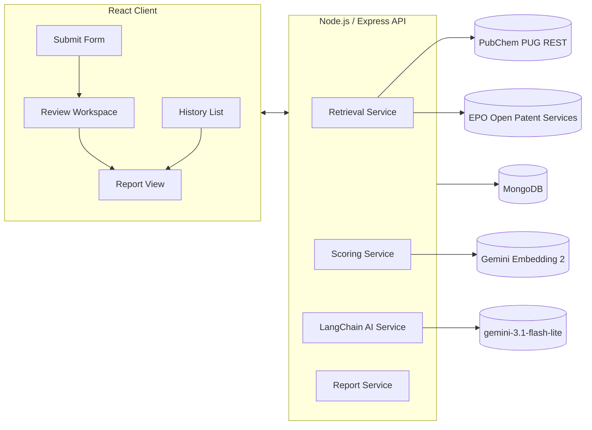

# PatentPilot

An AI-assisted Freedom-to-Operate (FTO) screening tool for small molecules. Submit a SMILES string and get ranked patent candidates, per-patent AI explanations, and a structured patentability report — all grounded in evidence from real patent databases.

> **Disclaimer:** PatentPilot is a screening tool only, not a legal opinion. Always consult a qualified patent attorney before any commercialization decision.

---

## Architecture



**Stack:**
- **Frontend:** React (Vite) + TailwindCSS + React Query + React Router
- **Backend:** Node.js + Express + Mongoose
- **Database:** MongoDB (local)
- **AI:** LangChain JS — `gemini-3.1-flash-lite` (analysis) + `gemini-embedding-2` (semantic scoring)
- **External APIs:** PubChem PUG REST (free, no key) + EPO Open Patent Services (free, registered key)

---

## Retrieval Strategy

PatentPilot uses a **hybrid retrieval pipeline** combining structural and keyword signals:

### 1. Structural Search (PubChem — free, no key)
1. Validate and canonicalize the input SMILES via PubChem PUG REST
2. Run a 2D fingerprint similarity search (`fastsimilarity_2d`) at an 85% Tanimoto threshold — returns up to 30 structurally similar CIDs
3. For each similar CID, query PubChem's patent cross-reference endpoint (`/xrefs/PatentID`) to get associated patent numbers
4. Tanimoto score estimated from search rank (query CID itself = 1.0, similar compounds decay slightly by rank)

### 2. Keyword Search (EPO OPS — free, registered key)
1. Build a CQL query from the molecule's biological target + indication + top PubChem synonyms
2. Search EPO OPS published-data endpoint (`ti="..." OR ab="..."`) — covers US, EP, WO and other patent families via INPADOC
3. Enrich each retrieved patent with full title, abstract, and assignee via EPO OPS biblio endpoint

### 3. Merge & Deduplicate
- Merge structural and keyword candidate sets, deduplicate by patent number
- Best tanimoto score wins on collision
- Upsert into MongoDB patent cache — repeat queries for related molecules reuse fetched metadata

---

## AI Workflow

Two LangChain chains using `gemini-3.1-flash-lite`:

### Chain A — Per-Patent Explanation
Runs on the **top-15 candidates by composite score only** (not all retrieved patents) to bound LLM cost and latency.

Input: molecule SMILES + target + indication + patent title/abstract + all 4 score components

Output (structured JSON, enforced via Zod schema):
```json
{
  "whyRetrieved": "which signal(s) fired and why, citing specific score values",
  "similarAspects": "specific structural or functional overlaps",
  "potentialOverlap": "plain-language FTO concern, citing patent text",
  "confidence": "High | Medium | Low",
  "confidenceReasoning": "one sentence explaining confidence level"
}
```

The system prompt explicitly forbids boilerplate output — every field must cite specific evidence from the patent text or score values.

### Chain B — Report Synthesis
Runs once per query. Input is the **Chain A outputs** (not raw patent text), keeping the report grounded in already-verified analysis.

The `recommendation` field is **computed deterministically** before Chain B runs — the LLM explains why the formula produced that result, not the other way around. This keeps every recommendation auditable and traceable.

---

## Scoring Methodology

**Per-patent composite score (0–100):**
```
composite = 0.4 × structuralSimilarity
          + 0.3 × semanticRelevance
          + 0.2 × keywordOverlap
          + 0.1 × recencyWeight
```

| Component | Source | Description |
|---|---|---|
| `structuralSimilarity` | PubChem Tanimoto | 2D fingerprint similarity to query molecule, scaled 0–100 |
| `semanticRelevance` | Gemini Embedding 2 | Cosine similarity between query context and patent title+abstract embeddings, scaled 0–100 |
| `keywordOverlap` | Text matching | Normalized match between target/indication terms and patent title+abstract |
| `recencyWeight` | Publication date | Patents within enforcement window (≤20 years) score higher; expired patents down-weighted |

**Risk Recommendation (deterministic formula — not LLM):**
| Tier | Condition |
|---|---|
| **Low Patent Risk** | Max composite < 40 AND no patent ≥ 70 |
| **Requires Expert Review** | Max composite 40–69 OR exactly one patent ≥ 70 with Low/Medium confidence |
| **High Patent Risk** | Structural similarity ≥ 85 on any patent OR two+ patents have composite ≥ 70 |

**Manual Review Flag** (per-patent, independent of risk tier): triggered when Chain A confidence = Low, or when `|structuralSimilarity − semanticRelevance| > 30`.

---

## Tech Stack

| Layer | Technology |
|---|---|
| Frontend | React 18 (Vite), TailwindCSS, React Query, React Router |
| Backend | Node.js, Express 4, ES Modules |
| Database | MongoDB 7 + Mongoose 8 |
| AI | LangChain JS, `gemini-3.1-flash-lite`, `gemini-embedding-2` |
| Structural search | PubChem PUG REST (`fastsimilarity_2d`, `xrefs/PatentID`) |
| Patent search | EPO Open Patent Services (OPS) — INPADOC/CQL |

---

## Assumptions

- Input is a valid small-molecule organic SMILES (not biologics/peptides/macromolecules)
- Free-tier public API coverage is sufficient for initial FTO screening — not a substitute for a comprehensive paid patent database
- Tanimoto scores are estimated from PubChem similarity search rank (patent-level Tanimoto is not available from PubChem's public API without a separate computation step)
- EPO OPS covers US, EP, WO and major patent offices via INPADOC family data — adequate for initial screening but not exhaustive
- English-language patents only (EPO OPS abstracts in English where available)

---

## Trade-offs

| Decision | Trade-off |
|---|---|
| PubChem patent xrefs over SureChEMBL | SureChEMBL's public REST API was discontinued in 2025. PubChem's `/xrefs/PatentID` provides the same structural → patent mapping, free and without a key |
| EPO OPS over USPTO PatentsView/ODP | USPTO's Open Data Portal now requires ID.me identity verification (passport video call for non-US users). EPO OPS requires only email registration and covers broader patent families |
| PubChem-hosted fingerprint similarity over local RDKit | Faster to ship, zero extra dependency, keeps the stack pure Node.js — at the cost of less chemically nuanced analysis than full scaffold/substructure matching |
| LLM analysis on top-15 only | Bounds cost and latency. Low-ranked patents by construction carry the least relevance — skipping their per-patent AI explanation is an acceptable trade-off |
| Deterministic recommendation formula | Sacrifices flexibility for auditability. Every recommendation is explainable by a fixed rubric, not a black-box LLM judgment |

---

## Local Setup

### Prerequisites
- Node.js 18+
- MongoDB running locally (or Docker: `docker run -d -p 27017:27017 mongo`)
- A free Google AI Studio API key (for `gemini-3.1-flash-lite` and `gemini-embedding-2`)
- A free EPO OPS developer account (register at `developers.epo.org`)

### 1. Clone and install
```bash
git clone https://github.com/saivignesh060/PatentPilot.git
cd PatentPilot
```

Install server dependencies:
```bash
cd server && npm install
```

Install client dependencies:
```bash
cd ../client && npm install
```

### 2. Configure environment
Copy `.env.example` to `.env` and fill in your keys:
```bash
cp .env.example .env
```

```env
GEMINI_API_KEY=your_key_from_aistudio.google.com
LLM_MODEL=gemini-3.1-flash-lite
EMBEDDING_MODEL=gemini-embedding-2
EPO_OPS_CONSUMER_KEY=your_epo_consumer_key
EPO_OPS_CONSUMER_SECRET=your_epo_consumer_secret
MONGODB_URI=mongodb://localhost:27017/patentpilot
PORT=5000
```

**Getting the keys:**
- Gemini: [aistudio.google.com/apikey](https://aistudio.google.com/apikey) — free, instant
- EPO OPS: [developers.epo.org/user/register](https://developers.epo.org/user/register) → choose "Non-paying" access → confirm email → My Apps → Add App → copy Consumer Key + Secret

### 3. Run
Start MongoDB (if not running):
```bash
docker run -d -p 27017:27017 mongo
```

Start the server (from `/server`):
```bash
npm run dev
```

Start the client (from `/client`, separate terminal):
```bash
npm run dev
```

Open **http://localhost:5173** in your browser.

### 4. Usage
1. Paste a SMILES string (e.g. `CC(C)Cc1ccc(cc1)C(C)C(=O)O` for Ibuprofen)
2. Optionally add a biological target and indication for better keyword matching
3. Wait for retrieval and scoring to complete (~15–30s depending on API response times)
4. Click **Run AI Analysis** to trigger per-patent explanations on the top-15 candidates
5. Click **Generate Report** to produce the full FTO report
6. Past analyses are saved to History for later retrieval — no re-running required

---

## Future Improvements

- **Non-US/EPO coverage:** Add Lens.org free tier to cross-check INPADOC results
- **Local RDKit:** Substructure/scaffold matching for chemically deeper structural analysis
- **Claim-level extraction:** Parse patent claim text (not just title/abstract) for higher-precision overlap analysis
- **Batch/portfolio mode:** Submit multiple molecules from a series and compare risk profiles side by side
- **Export:** PDF/DOCX report export for sharing outside the tool
- **Real Tanimoto scores:** Compute actual per-patent Tanimoto using RDKit or a dedicated fingerprint service instead of rank-based estimates
